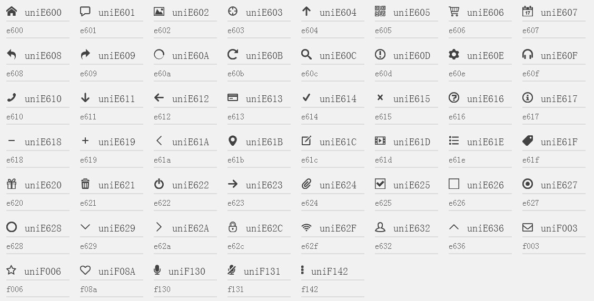

#Sandal
`sandal`取其“檀香”之意，针对`web app`，为前端人员提供了一些基础和常用的`scss`，基于它你可以扩展出各种组件。

##如何使用
sandal和[sassCore](https://github.com/marvin1023/sassCore)一样，分核心文件和扩展文件两种。其中核心文件提供一些基础的样式和@mixin，%等方便调用；而扩展文件则提供一些模块的样式。

###核心文件调用

第一种除提供基础功能外，会产生一份`reset`样式：

	@import "d:/sandal/base";

第二种不产生任何样式，只提供功能的调用：

	@import "d:/sandal/function";

###扩展文件调用

根据需要调用，以`font-face`为例：

	@import "d:/sandal/ext/font-face/font-face";

注：因为`sass`不能导入在线`sass`文件，而sandal也没有提供安装版的使用，所以默认统一放在D盘进行调用。

##文件简述

sandal包括两个集合文件（base，function）和两个文件夹（core，ext）。其中core文件夹中为核心基础文件，包括setting，css3，media-queries，mixin，page-animate，reset；而ext文件夹中是一些扩展文件，包括font-face。

两个集合文件（base，function）导入的都是core中的文件，区别在于base除了提供基本功能之外还会生成一份reset样式，而function则只提供基本功能。至于ext中的文件则属于额外的一些模块扩展，可根据需求导入。

###core文件

####setting
负责基础变量的文件，如常用的颜色，字体等变量。

####css3
负责css3属性前缀的文件。根据浏览器前缀支持情况，及移动端特点，定义了更好的移动端的前缀及兼容。

####media-queries
负责响应式宽度判断的文件。主要是对响应式布局的一些宽度判断，来自paranoida的[sass-mediaqueries](https://github.com/paranoida/sass-mediaqueries)。

####mixin
负责功能方面的文件。这里我们大概分成三个部分，一个是混合部分即mixin（主要定义了一些常用的`flex`,`translate`等），一个是placeholder选择器部分即%，最后就是我们的function函数部分。我们常用的include及extend当然就是来自于这里了。

####page-animate
负责页面切入动画，目前分为渐隐出入及上下左右切入切出。

###reset
在[normalize](http://necolas.github.io/normalize.css/)的基础上，根据目前我们大家的使用习惯进行了一些归零行动，及设置文字字体颜色。

###ext文件

####font-face
从[icomoon](http://icomoon.io)提取了几个常用的字体图标，当然也可以根据个人的需求使用其他字体图标，默认不输出任何class，可根据实际需求输出其中的某些icon。（一些方向上的图标只提供了一个方向的，可根据需要使用rotate旋转。）

